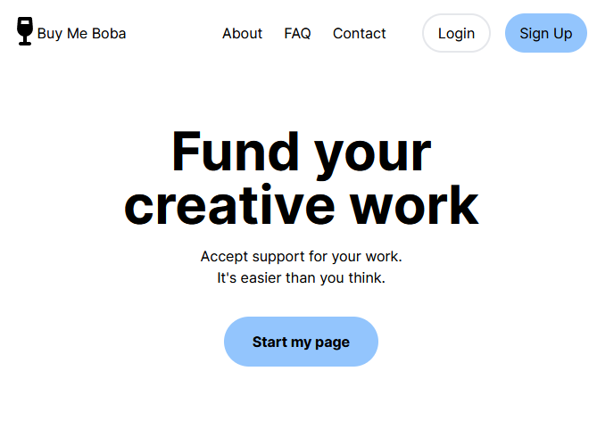
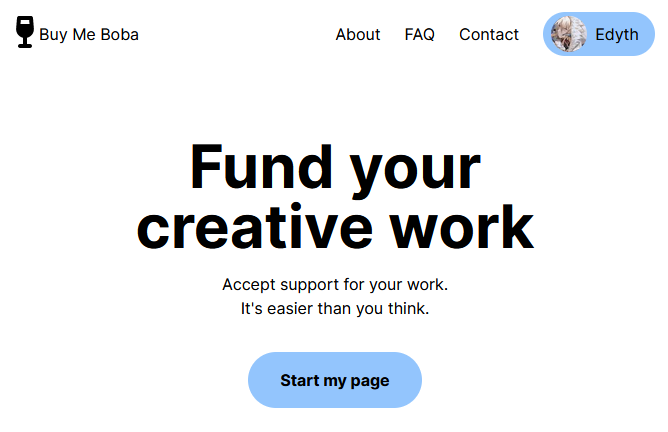

# 4/26
* Started from pnpm next-app boilerplate 
* Created basic homepage 

* finished authentication via next auth, can sign in via google
* set up google authentication connected to MongoDB to store user profiles/ session

* next steps: set up profile page/ settings page